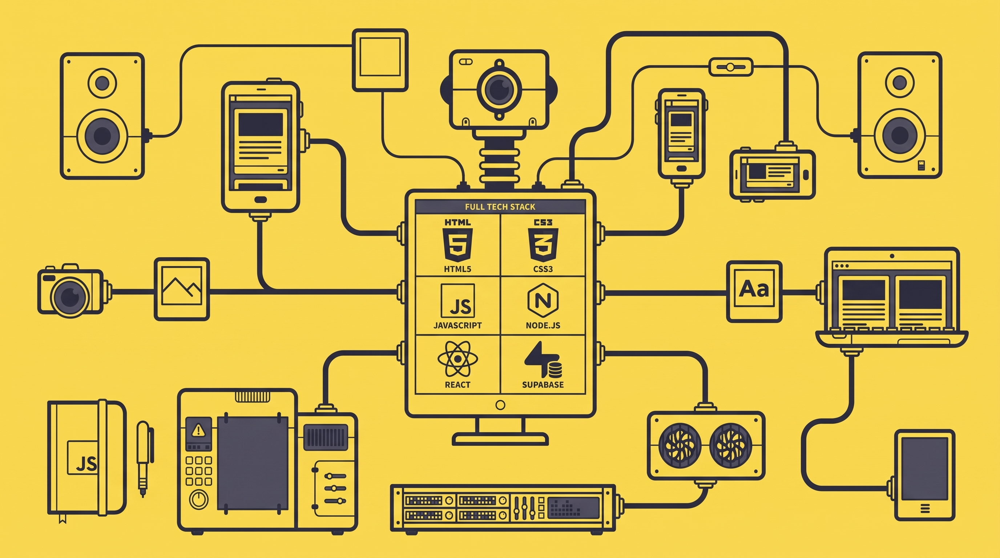

  
 
 <h1>Hi 👋, I'm Rongon Kairy 👋</h1> 

💫 About Me:
I am a passionate Digital Content Creator & Educator focused on helping people navigate freelancing, AI tools, and passive income strategy. I love building digital platforms, sharing practical tutorials, and creating content that makes an international impact. 🔭 I’m currently working on growing my YouTube channel (Rongon Kairy) and digital brand 🌱 I’m currently learning advanced GEO (Generative Engine Optimization) and scaling content systems 💬 Ask me about SEO, Content Strategy, AI tools for income, and Affiliate Marketing ⚡ Fun fact: I design content strategies specifically tailored to reach a global audience, especially the USA market!

## 🌐 Socials:
    

# 💻 Tech Stack:
     
# 📊 GitHub Stats:
 
 

---

<!-- Proudly created with GPRM ( https://gprm.itsvg.in ) -->
